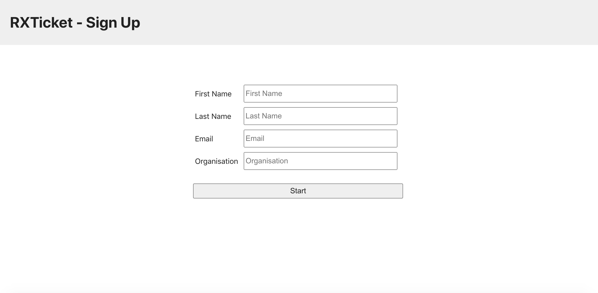
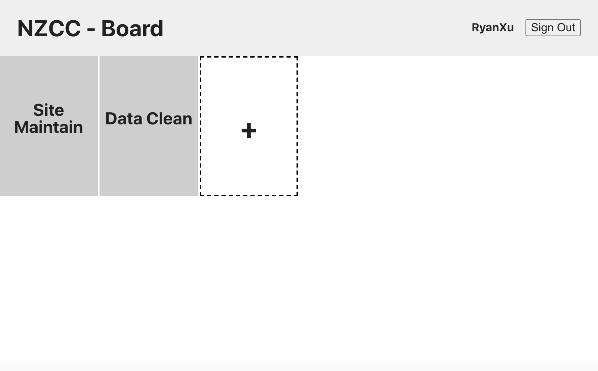
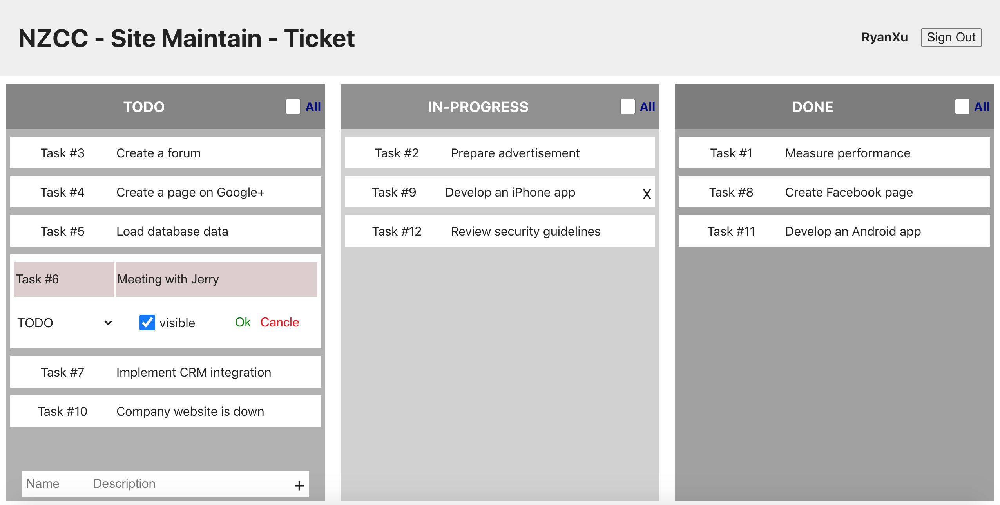

# Board - Ticket





## Project Structure

```
.
├── App.css
├── App.test.tsx
├── App.tsx
├── apollo                 // Apollo Client config & init
│   ├── cache.ts
│   └── index.ts
├── components             // presentation & required state management
│   ├── AddBoard
│   ├── AddTicket
│   ├── BoardItem
│   ├── BoardPanel
│   ├── ColumnHeader
│   ├── EditTicket
│   ├── Header
│   ├── Overlay
│   ├── TicketItem
│   └── UserForm
├── containers             // data operation & UI logic
│   ├── BoardPanel.tsx
│   ├── Column.tsx
│   ├── TicketItem.tsx
│   ├── TicketPanel.tsx
│   └── UserForm.tsx
├── index.css
├── index.tsx
├── logo.svg
├── models
│   ├── localType.ts       // local shared type
│   └── type.ts            // gererated type from graphql schema
├── operations             // graphql definition
│   ├── mutations
│   └── queries
├── pages
│   ├── Board.tsx
│   ├── SignUp.tsx
│   └── Ticket.tsx
├── react-app-env.d.ts
├── reportWebVitals.ts
├── setupTests.ts
└── utils
    └── keyUtil.ts        // gererate key for local storage

```


## Technology Stack

[Apollo Client for React](https://www.apollographql.com/docs/react/)

