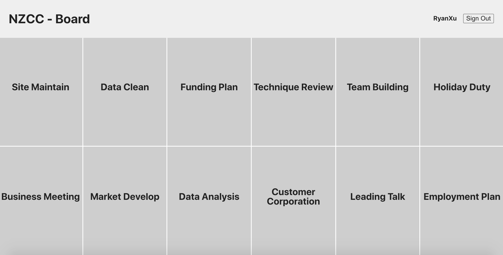

# Board - Ticket
Any problem, please email me: <mark>***hitxcl@gmail.com***</mark>





## Project Structure

```
.
├── App.css
├── App.test.tsx
├── App.tsx
├── apollo                 // Apollo Client config & init
│   ├── cache.ts
│   └── index.ts
├── components             // presentation & required state management
│   ├── AddBoard
│   ├── AddTicket
│   ├── BoardItem
│   ├── BoardPanel
│   ├── ColumnHeader
│   ├── EditTicket
│   ├── Header
│   ├── Overlay
│   ├── TicketItem
│   └── UserForm
├── containers             // data operation & UI logic
│   ├── BoardPanel.tsx
│   ├── Column.tsx
│   ├── TicketItem.tsx
│   ├── TicketPanel.tsx
│   └── UserForm.tsx
├── index.css
├── index.tsx
├── logo.svg
├── models
│   ├── localType.ts       // local shared type
│   └── type.ts            // gererated type from graphql schema
├── operations             // graphql definition
│   ├── mutations
│   └── queries
├── pages
│   ├── Board.tsx
│   ├── SignUp.tsx
│   └── Ticket.tsx
├── react-app-env.d.ts
├── reportWebVitals.ts
├── setupTests.ts
└── utils
    └── keyUtil.ts        // gererate key for local storage

```


## Technology Stack

[Apollo Client for React](https://www.apollographql.com/docs/react/)

## Run Me
In order to avoid polluting the given service & data, application could <mark>***run in different environment***</mark>. Run the following command if you didn't install dotenv-cli before.

```
> yarn global add dotenv-cli
```
### Run for Development
All the operation will take effect in [Ryan-Dev](https://14g8921io8.execute-api.us-east-1.amazonaws.com/ryan-dev-ticket) environment

```
> yarn start:dev
```

### Run for Test
All the operation will take effect in [Phocas-Given](https://14g8921io8.execute-api.us-east-1.amazonaws.com/ryan-dev-ticket) environment

```
> yarn start
```

## Notice
* No responsive design, use <mark>***full screen in Chrome***</mark> for better UI presentation.
* <mark>***No Unit Test***</mark> for this project, but most of the components are testable.


## Conventions
* Board Update & Deletion are not supported currently.
* You can only create <mark>***todo-status tikets***</mark> by the understanding of each ticket should start its lifecycle at todo status.

